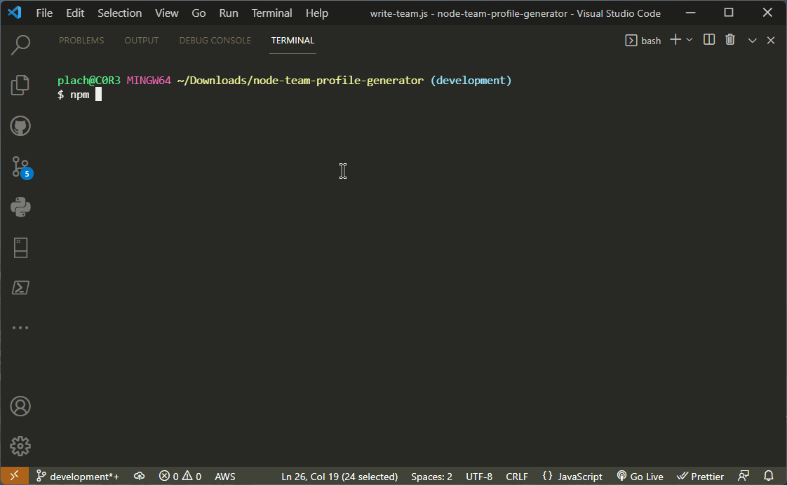
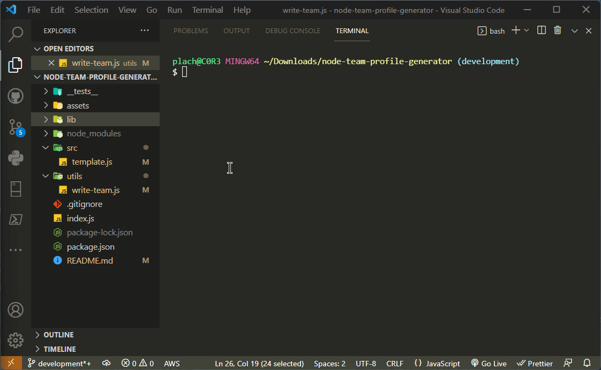
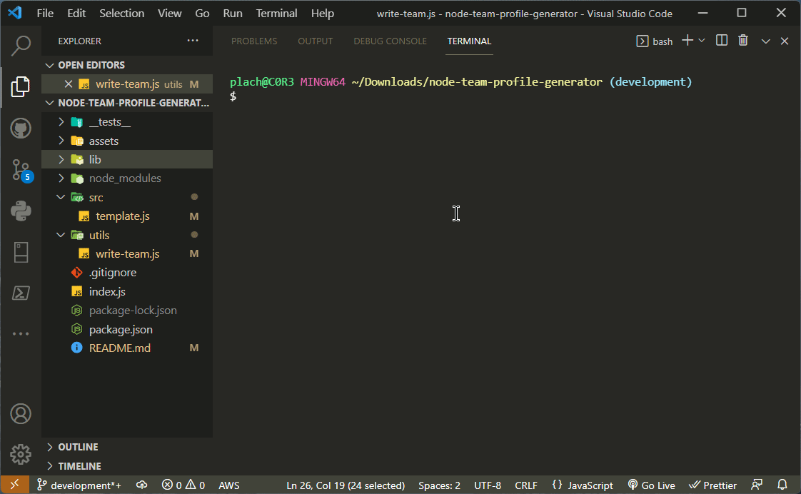
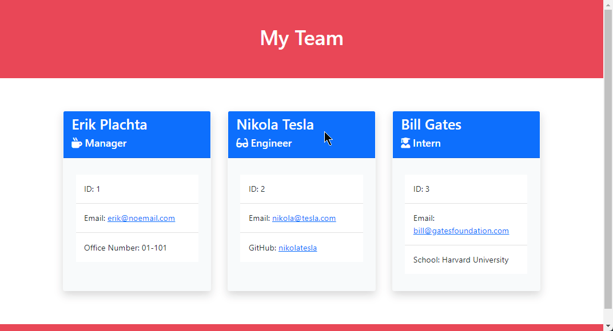
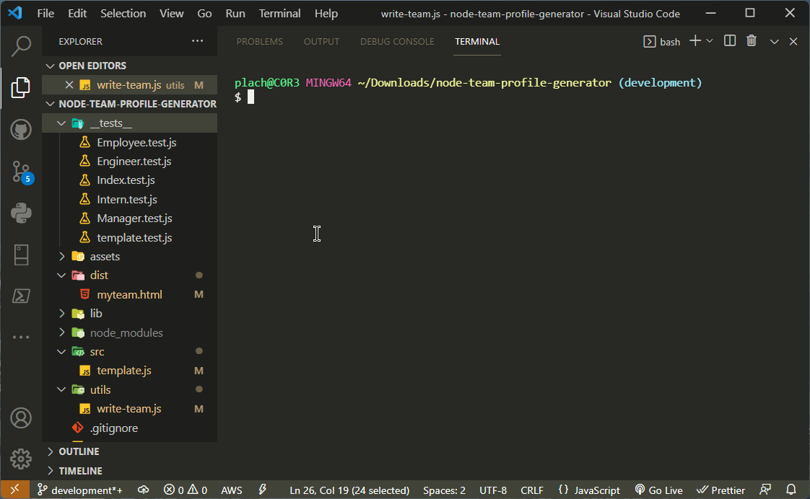

# node-team-profile-generator

> **This is a fully-functional proof of concept app designed to show the power
> and flexability of Node.js along with Inquirer.js, and Jest.js NPM packges.**

## Index

- [Summary](#summary)
- [functionality](#functionality)
- [Useage](#useage)
    - [Requirements](#requirements)
    - [Installation](#installation)
    - [Using The App](#using-the-app)
    - [Starting the App](#starting-the-app)
    - [Viewing Results](#viewing-results)
    - [Requirements](#requirements)
    - [Video of Full Process](#test-with-jest-passing)
- [Repo Stats](#repo-stats)
- [Contributors](#contributors)
- [Questions?](#questions)

## Summary

Build a Node.js command-line application that takes in information about employees
on a software engineering team and generates an HTML webpage that displays
summaries for each person. Because testing is key to making code maintainable,
you’ll also write unit tests for each part of your code and ensure that it passes
all of them.

## Features

1 WHEN testing the App, THEN user can type `npm jest` to verify
2. WHEN using the App, THEN user is presented with a **CLI** prompting for employee details including Name, Email, and employee Role within the team of either Manager, Engineer, and Intern. 
3. WHEN user selects the employees role, THEN they're prompted with a unique detail to fill in for that employee.
4. WHEN user finalizes enter employee details, THEN user is prompted to verify employee information. If incorrect, user can select no and re-enter the detiails otherwise select yes. 
5. WHEN user is finished building their team, THEN user selects YES on prompt after creating employee to generate an HTML file of the team deteails. At this time the CLI will close.
6. WHEN user views the HTML file, they can view the team details. 
7. WHEN user selects an email address from the HTML file, their default Email application will open to allow user to send an email to specific employee.

---

## Usage

> Below I've broken down app requirements, how to install, start, use, and then view the results of this app.

### Requirements

- [Node.js](https://nodejs.org/en/)
- [Inquierer.js](https://www.npmjs.com/package/inquirer)
- [Jest.js](https://www.npmjs.com/package/jest)

### Installation

> This app is designed to be ran locally. That means you'll need to download the repo. Once it's downloaded, you'll need to run `npm i` to install the required NPM packages.

### Starting The App

<!--  -->

### Using the App

<!--  -->

### Viewing Results

<!--  -->

### Test with Jest Passing

- Here is a video demonstrating all tests ran with jest as passing
<!--  -->

## Repo Stats

## Contributors

### [Erik Plachta](https://github.com/ErikPlachta)

- I've built this project from the ground up.

## Questions?

> Feel free to contact me on my twitter @ErikPlachta
